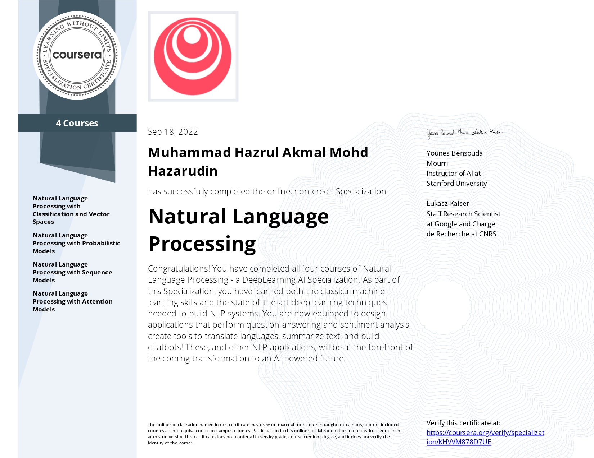

# Contents
Natural Language Processing (NLP) is a subfield of linguistics, computer science, and artificial intelligence that uses algorithms to interpret and manipulate human language.

This technology is one of the most broadly applied areas of machine learning and is critical in effectively analyzing massive quantities of unstructured, text-heavy data. As AI continues to expand, so will the demand for professionals skilled at building models that analyze speech and language, uncover contextual patterns, and produce insights from text and audio.

This Specialization is designed and taught by two experts in NLP, machine learning, and deep learning. Younes Bensouda Mourri is an Instructor of AI at Stanford University who also helped build the Deep Learning Specialization. Łukasz Kaiser is a Staff Research Scientist at Google Brain and the co-author of Tensorflow, the Tensor2Tensor and Trax libraries, and the Transformer paper.

[**Classification and Vector Spaces**](https://github.com/hazrulakmal/deep-learning/tree/main/nlp/coursera%20NLP%20Specialisation/classification%20and%20vector%20spaces)

1. Perform sentiment analysis of tweets using logistic regression and then naïve Bayes,
2. Use vector space models to discover relationships between words and use PCA to reduce the dimensionality of the vector space and visualize those relationships, and
3. Write a simple English to French translation algorithm using pre-computed word embeddings and locality-sensitive hashing to relate words via approximate k-nearest neighbor search.  

[**Probabilistic Models**](https://github.com/hazrulakmal/deep-learning/tree/main/nlp/coursera%20NLP%20Specialisation/probabilistic%20models)

1. Create a simple auto-correct algorithm using minimum edit distance and dynamic programming,
2. Apply the Viterbi Algorithm for part-of-speech (POS) tagging
3. Write a better auto-complete algorithm using an N-gram language model, and
4. Write your own Word2Vec model that uses a neural network to compute word embeddings using a continuous bag-of-words model.

[**Sequence Models**](https://github.com/hazrulakmal/deep-learning/tree/main/nlp/coursera%20NLP%20Specialisation/sequence%20models)

1. Train a neural network with GLoVe word embeddings to perform sentiment analysis of tweets,
2. Generate synthetic Shakespeare text using a Gated Recurrent Unit (GRU) language model,
3. Train a recurrent neural network to perform named entity recognition (NER) using LSTMs with linear layers, and
4. Use so-called ‘Siamese’ LSTM models to compare questions in a corpus and identify those that are worded differently but have the same meaning.

[**Attention Models**](https://github.com/hazrulakmal/deep-learning/tree/main/nlp/coursera%20NLP%20Specialisation/attention%20models)

1. Translate complete English sentences into German using an encoder-decoder attention model,
2. Build a Transformer model to summarize text,
3. Use T5 and BERT models to perform question-answering, and
4. Build a chatbot using a Reformer model. (Locality Hashing & Reversible Layers)

